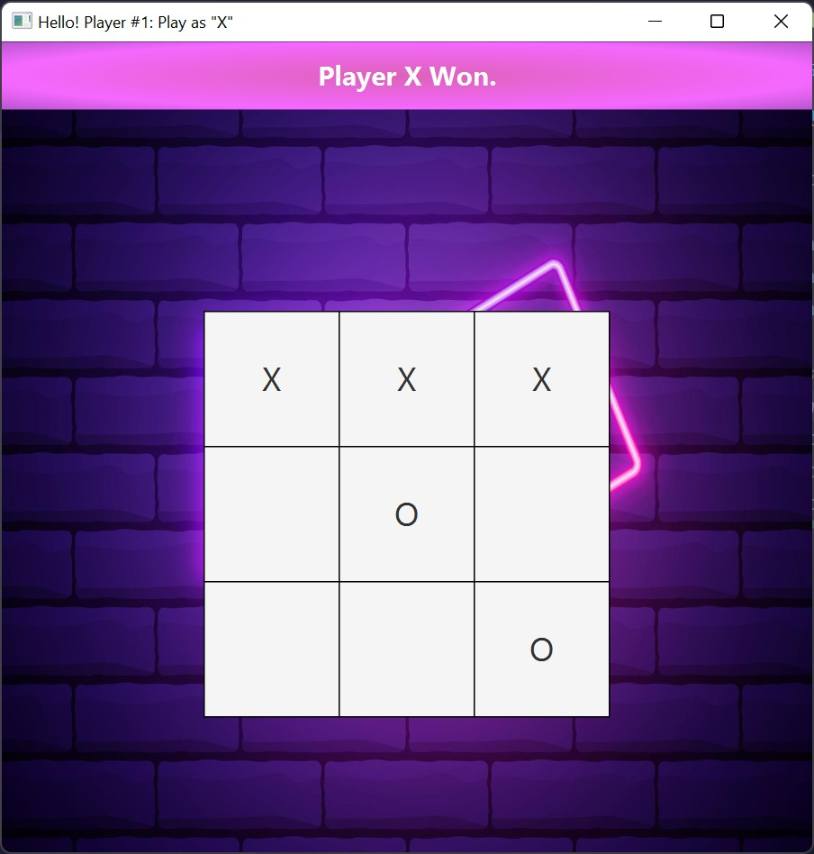
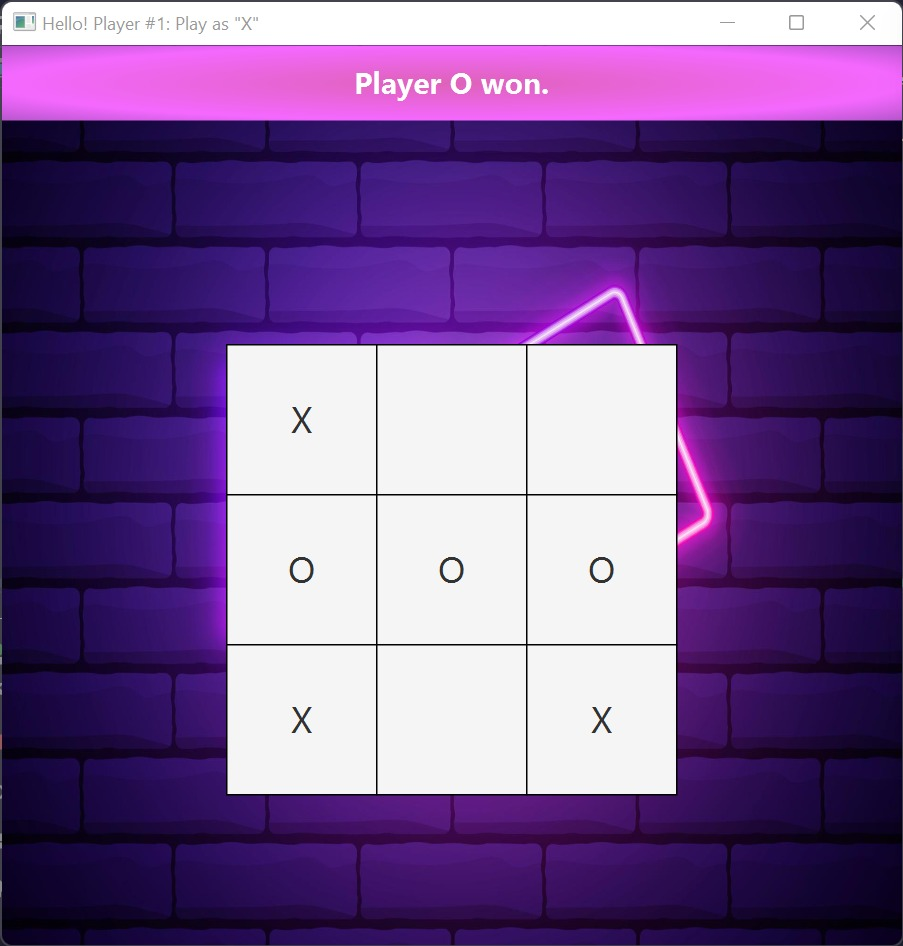
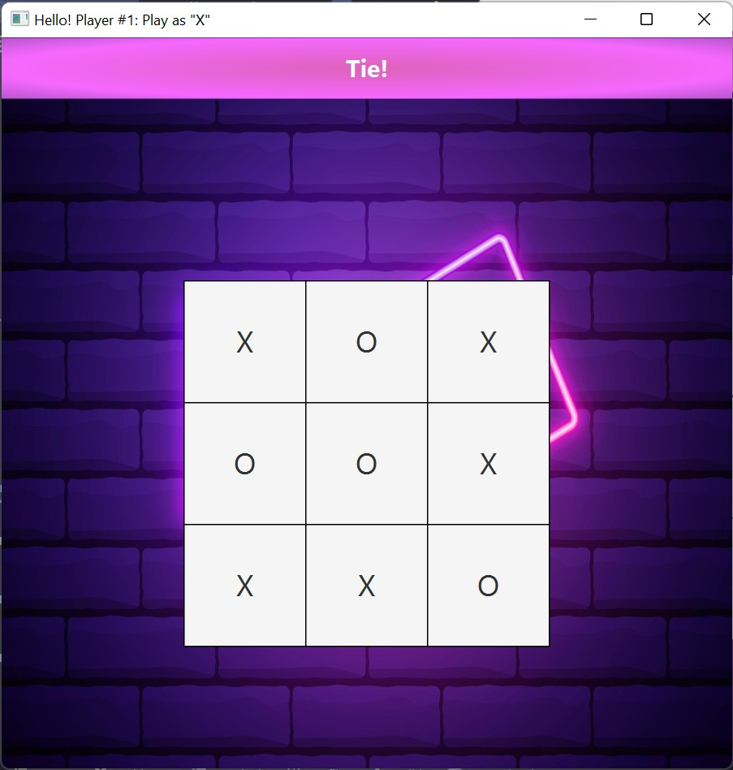

<h1 align="center"> ❌⭕ TIC TAC TOE ❌⭕ </h1>
<h3 align="center"> CSCI2020U - Software Systems and Integrations 👩🏽‍💻 </h3>
<h5 align="center"> Final Group Project (Winter 2022) </h5>

<!-- TABLE OF CONTENTS -->
<h2 id="table-of-contents"> :book: Table of Contents</h2>

  
Table of Contents

  <ol>
    <li><a href="#about-the-project"> ➤ About The Project</a></li>
    <li><a href="#project-files-description"> ➤ Project Files Description</a></li>
    <li><a href="#getting-started"> ➤ Getting Started</a></li>
    <li><a href="#scenario1"> ➤ Scenario 1: Main Player Wins </a></li>
    <li><a href="#scenario2"> ➤ Scenario 2: Opponent Wins </a></li>
    <li><a href="#scenario3"> ➤ Scenario 3: Both Players Form a Tie </a></li>
    <li><a href="#acknowledgements"> ➤ Acknowledgements </a></li>
    <li><a href="#references"> ➤ References</a></li>
    <li><a href="#credits"> ➤ Credits</a></li>
  </ol>

<!-- ABOUT THE PROJECT -->
<h2 id="about-the-project"> :pencil: About The Project</h2>

 
  Tic-Tac-Toe is a two player game where each player takes turn placing an X or O, based on who chooses the tick, to form a vertical, horizontal, or diagonal line. First player to get three Os or Xs to form a straight line wins. For consistency, this project's main player will use X while the oponent will use O.

<!-- PROJECT FILES DESCRIPTION -->
<h2 id="project-files-description"> Project Files Description</h2>

<ul>
  <li><b>GameServer.java</b> -  </li>
  <li><b>Player.java</b> -   </li>
  <li><b>InfoCenter.java</b> -   </li>
  <li><b>TileBoard.java</b> -   </li>
  <li><b>UIConstants.java</b> -   </li>
</ul>

<h3>Some other supporting files</h3>
<ul>
  <li><b>we will enter pics and all.py</b> - Project specific autograding test classes.</li>
</ul>

<!-- GETTING STARTED -->
<h2 id="getting-started"> Getting Started</h2>

You are able to start the game by <b> first navigating to the package folder </b> and typing the following commands in the command line:

<pre><code>$ java GameServer.java</code></pre>
<pre><code>$ java Player.java</code></pre>
<pre><code>$ java Player.java</code></pre>

 📽️ You can view our video demo on how to run the file and a test run of the game: https://www.loom.com/share/3f8da600c3c54b7fad111489ca4f2804

<!-- SCENARIO1 -->
<h2 id="scenario1"> Scenario 1: Main Player Wins </h2>

 When the main player (player who gets first turn) wins, the three Xs will be recorded with a "Winner" message display on the main player's window, accouncing the winner on both clients' server.

 

<!--height="382px" width="737px"-->

<!-- SCENARIO2 -->
<h2 id="scenario2"> Scenario 2: Opponent Wins </h2>

 When the opponent (player who gets second turn) wins, the three Os will be shown with a "Winner" message display on the opponent's window, accouncing the winner on both clients' server.

 

<!--height="382px" width="737px"-->

<!-- SCENARIO3 -->
<h2 id="scenario3"> Scenario 3: Both Player Forms a Tie</h2>

 If there comes a chance that no one has formed a straight line by the end of the game, the game will end with the "It is a tie" massage displaying on both player's window.

 

<!--height="382px" width="737px"-->

<!-- Acknowledgements -->
<h2 id="acknowledgements"> Acknowledgements</h2>
This project was submitted as the final course project for CSCI 2020U “Software Systems and Integration” during Winter 2022. The authors certify that the work in this repository is original and that all appropriate resources are rightfully cited.

 

<!-- CREDITS -->
<h2 id="credits"> Credits</h2>

Japnit  Jessica   Chioma   Aanisha
